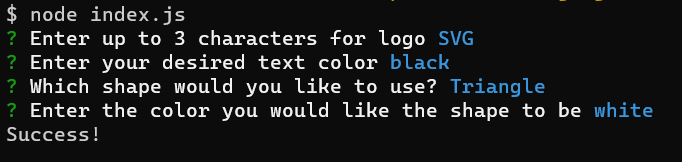
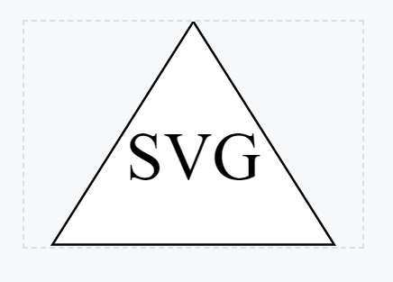

# Logo Generator

## Description

This is my logo generator! This simple node app takes in 4 parameters and builds a beautiful logo with your selection of text color, shape, shape background color and 3 letters to be in the center and also has a nice black border around all the shapes. Also includes jest testing for applying the colors and text correctly. Enjoy

## Screenshots

Link to video: https://drive.google.com/file/d/1OnZwcyWzvC9Dtn1Y91qsgs6z9Jj-zcn-/view

## Testing

Tests are available through jest and it tests the placement of all properties for all shapes using npm test 

## Usage

Just download do npm i and node into the index file!
